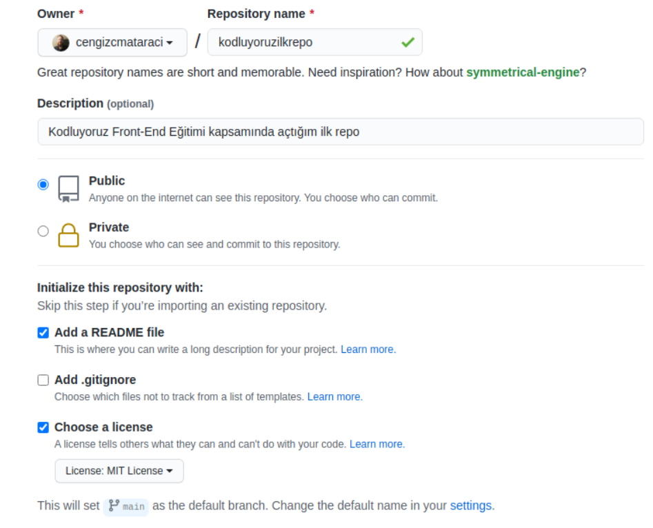

Bu repo Kodluyoruz Front-End Eğitiminde oluşturduğumuz ilk repo. İçerisinde bir adet README dosyası, bir adet de index.html barındırıyor.

## Installation

Önce projeyi klonladık (buraya kendi repomuzdan aldığımız link gelecek).

`git clone https://github.com/AnilKly/kodluyoruzilkrepo`

## Usage

Projeyi klonladıktan sonra Visual Studio Code programında açtık.

Linux için:

cd kodluyoruzilkrepo
code.

## Contributing

Pull requestler kabul edilir. Büyük değişiklikler için, lütfen önce neyi değiştirmek istediğinizi tartışmak için bir konu açınız.

## License

[MIT](https://choosealicense.com/licenses/mit/)

Patika.dev

